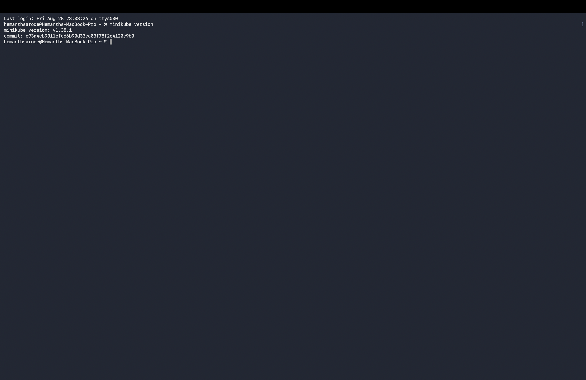
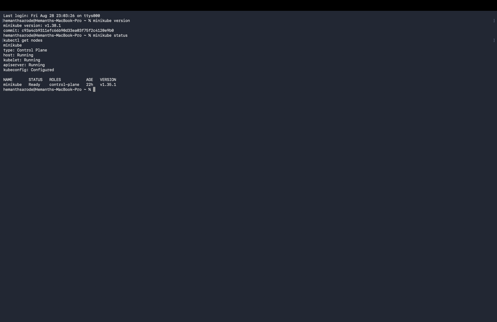
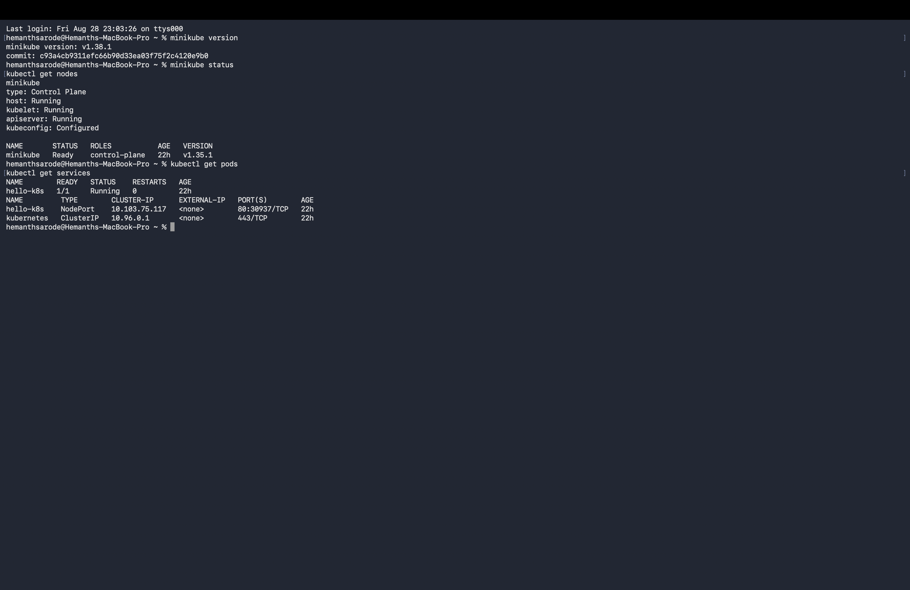
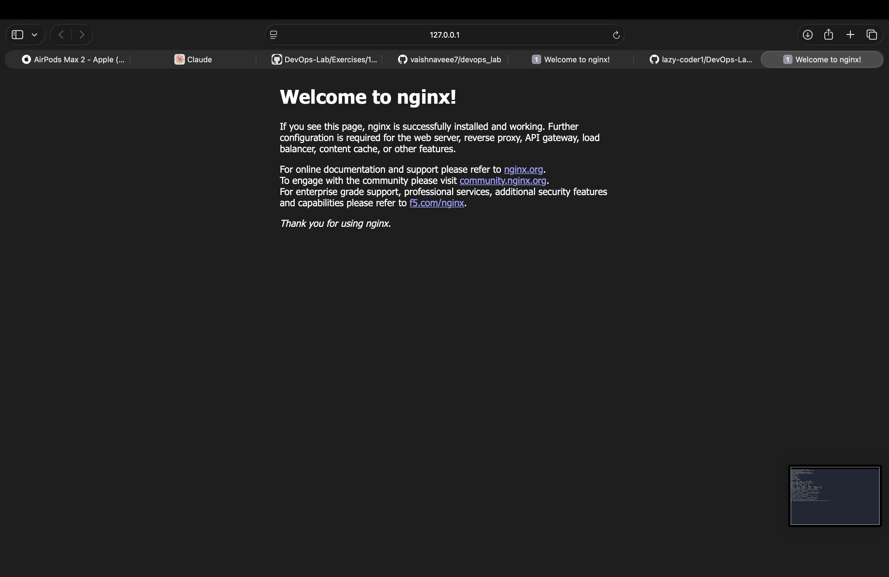

# Kubernetes Exercise 1 

## Objective

The objective of this exercise is to deploy and access a containerized application using Kubernetes and Minikube.

In this exercise, an **Nginx container** is used to simulate a web application that needs to be deployed on Kubernetes.

---

##  Prerequisites

* Windows
* Docker Desktop
* Minikube
* kubectl

Minikube requires Docker or another supported VM driver.

---

##  Steps Performed

### 1. Start Minikube

Started the local Kubernetes cluster using the Docker driver:

```bash
minikube start 
```

### 2 Create the Kubernetes Pod

Created an Nginx Pod using:

```bash
kubectl run hello-k8s --image=nginx --port=80
```

### 3. Verify the Pod

Checked the status of the Pod:

```bash
kubectl get pods
```

The Pod was successfully created and reached the `Running` state.

### 4. Expose the Pod

Exposed the Pod using a NodePort service:

```bash
kubectl expose pod hello-k8s --type=NodePort --port=80
```

### 5. Access the Application

Opened the deployed Nginx application using:

```bash
minikube service hello-k8s
```

The Nginx welcome page was successfully displayed in the browser.

---

## Screenshots

### Minikube Installation



### Minikube Cluster Started



### Kubernetes Pod and Service



### Nginx Welcome Page



---

##  Result

Successfully deployed an **Nginx container as a Kubernetes Pod** using Minikube, exposed it through a Kubernetes Service, and accessed the application through a web browser.

---
