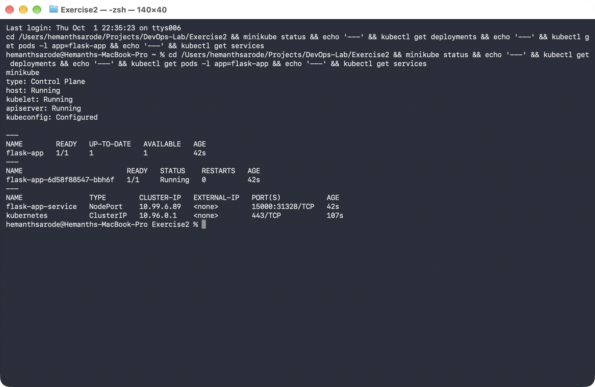

# Exercise 2: Deploy a Flask App on Minikube using kubectl and YAML

## Objective

Deploy a Python Flask application on a local Kubernetes cluster using Minikube,
build the container image with Minikube's own Docker daemon, and expose it
through a Kubernetes Service.

## Environment

- Operating System: macOS
- Architecture: Apple Silicon (arm64)
- Shell: Terminal / zsh
- Container Runtime: Docker Desktop
- Kubernetes: Minikube
- Kubernetes CLI: kubectl

## Prerequisites

- Docker Desktop
- Minikube
- kubectl

## 1. Start Minikube

```bash
minikube start
```

### 2. Create the Flask Application

File: [app.py](./app.py)

```python
from flask import Flask
app = Flask(__name__)

@app.route('/')
def home():
    return "Hello from Flask on Kubernetes!"

if __name__ == '__main__':
    app.run(host='0.0.0.0', port=15000)
```

### 3. Create the Dockerfile

File: [Dockerfile](./Dockerfile)

```dockerfile
FROM python:3.8-slim
WORKDIR /app
COPY . /app
RUN pip install flask
CMD ["python", "app.py"]
```

### 4. Build the Image Using Minikube's Docker Daemon

Pointing the local Docker CLI at Minikube's internal daemon lets the cluster
use the image directly, without pushing it to a registry.

```bash
eval $(minikube docker-env)
docker build -t flask-app .
```

### 5. Create the Kubernetes Deployment and Service

File: [flask-deployment.yaml](./flask-deployment.yaml)

The Deployment runs the Flask container with `imagePullPolicy: Never` so
Kubernetes uses the locally built `flask-app:latest` image instead of trying
to pull it from a remote registry. The Service maps external port `15000` to
the container's `targetPort: 15000`, so traffic can reach the Flask app
running inside the pod.

```yaml
apiVersion: apps/v1
kind: Deployment
metadata:
  name: flask-app
spec:
  replicas: 1
  selector:
    matchLabels:
      app: flask-app
  template:
    metadata:
      labels:
        app: flask-app
    spec:
      containers:
      - name: flask-app
        image: flask-app:latest
        imagePullPolicy: Never
        ports:
        - containerPort: 15000
---
apiVersion: v1
kind: Service
metadata:
  name: flask-app-service
spec:
  selector:
    app: flask-app
  ports:
  - port: 15000
    targetPort: 15000
  type: NodePort
```

### 6. Deploy the Application

```bash
kubectl apply -f flask-deployment.yaml
```

### 7. Verify Deployment, Pods, and Service

```bash
kubectl get deployments
kubectl get pods -l app=flask-app
kubectl get services
```

The deployment reached `1/1 READY`, the pod reached `Running`, and
`flask-app-service` was created as a `NodePort` mapping port `15000`.



### 8. Access the Flask App

Minikube exposes NodePort services through a local tunnel URL:

```bash
minikube service flask-app-service --url
```

Using the returned URL confirmed the app was reachable and responding:

```bash
curl http://127.0.0.1:55792
Hello from Flask on Kubernetes!
```


---

## Result

Successfully built a Flask application image using Minikube's Docker daemon,
deployed it to a local Kubernetes cluster with a Deployment, and exposed it
externally via a NodePort Service. The app responded with
**"Hello from Flask on Kubernetes!"** when accessed through the Minikube
service URL.
