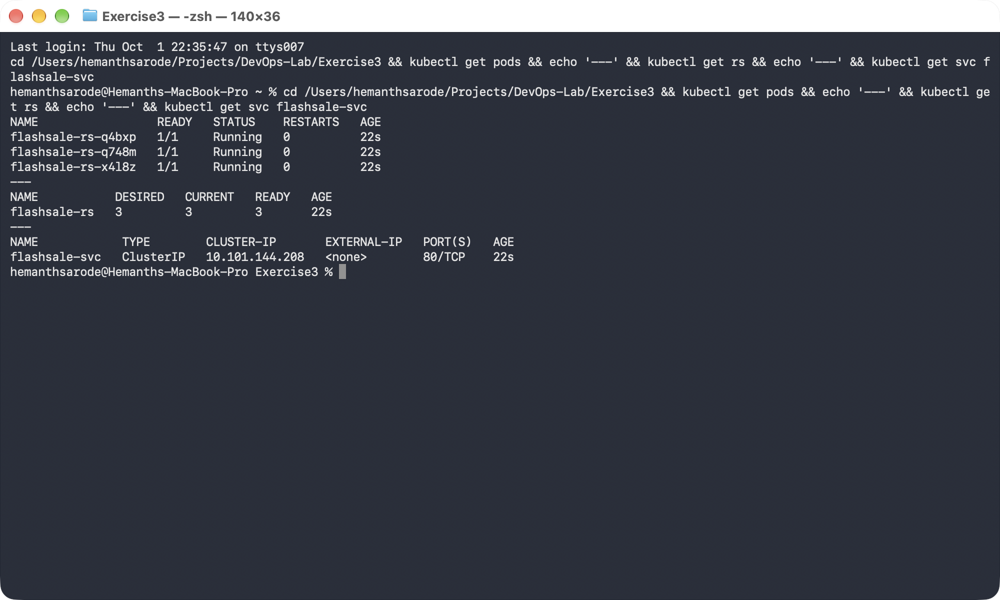
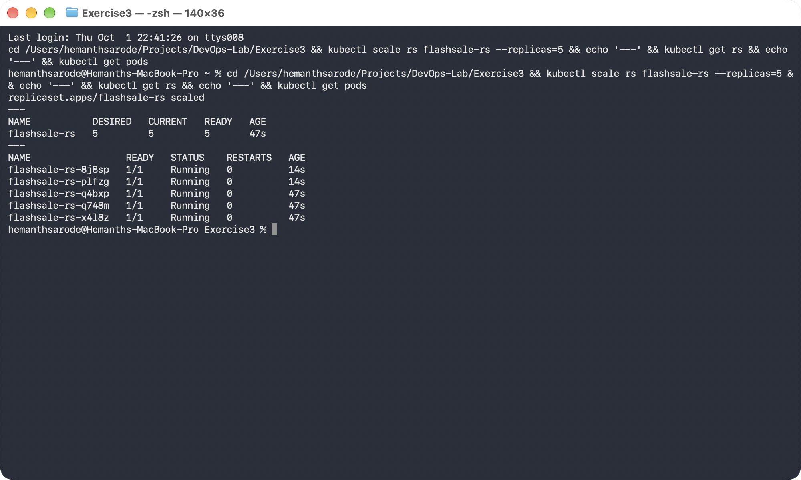
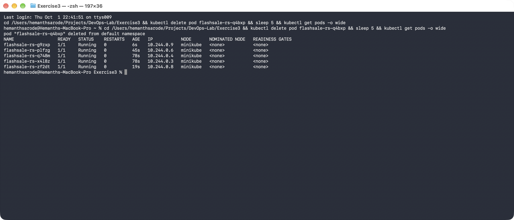

# Exercise 3: Scaling a Flask App on a Single Node Using ReplicaSets

## Objective

Understand how Kubernetes ReplicaSets keep a desired number of Pods running,
scale a Flask "flash sale" app up and down, and observe Kubernetes
automatically replacing a Pod that is deleted.

## Environment

- Operating System: macOS
- Architecture: Apple Silicon (arm64)
- Shell: Terminal / zsh
- Container Runtime: Docker Desktop
- Kubernetes: Minikube (single node)
- Kubernetes CLI: kubectl

## 1. Create the Flash Sale App

File: [app.py](./app.py)

The app simulates a flash-sale checkout service with three routes:

- `/` — welcome message, includes the serving Pod's hostname.
- `/buy` — simulates a checkout, returns a random item and the Pod that served it (useful for observing load distribution across Pods).
- `/health` — used by the readiness/liveness probes.

### 2. Create the Dockerfile

File: [Dockerfile](./Dockerfile)

```dockerfile
FROM python:3.11-slim
WORKDIR /app
COPY app.py .
RUN pip install --no-cache-dir flask gunicorn
CMD ["gunicorn","-b","0.0.0.0:5000","app:app","--workers","1","--threads","2"]
```

### 3. Reset Minikube and Start a Single Node

```bash
minikube stop
minikube delete
minikube start --nodes=1
kubectl get nodes
```

```
NAME       STATUS   ROLES           AGE   VERSION
minikube   Ready    control-plane   7s    v1.35.1
```

### 4. Build the Image Using Minikube's Docker Daemon

```bash
eval $(minikube docker-env)
docker build -t flashsale:1.0 .
```

The ReplicaSet below uses `imagePullPolicy: Never` so the cluster runs this
locally built image directly, without needing to push it to Docker Hub.

### 5. Create the ReplicaSet and Service

File: [flashsale-replicaset.yaml](./flashsale-replicaset.yaml)

3 replicas are requested initially, each with readiness/liveness probes
hitting `/health`, and resource requests/limits. A `ClusterIP` Service
(`flashsale-svc`) fronts the Pods on port 80.

### 6. Apply the Configuration

```bash
kubectl apply -f flashsale-replicaset.yaml
```

### 7. Verify the ReplicaSet and Pods

```bash
kubectl get pods
kubectl get rs
kubectl get svc flashsale-svc
```

All 3 Pods reached `Running`, and the ReplicaSet reported `3 DESIRED / 3 CURRENT / 3 READY`.



### 8. Scale the ReplicaSet to 5 Replicas

```bash
kubectl scale rs flashsale-rs --replicas=5
kubectl get rs
kubectl get pods
```

Kubernetes created 2 additional Pods to reach the desired count of 5.



### 9. Delete a Pod and Observe Self-Healing

```bash
kubectl delete pod flashsale-rs-q4bxp
kubectl get pods -o wide
```

As soon as the Pod was deleted, the ReplicaSet controller created a brand
new Pod (`flashsale-rs-g9zxp`, age 6s) to bring the count back to 5 — all
Pods ran on the single `minikube` node.



---

## Key Observations

- **Pod Distribution** — each Pod is an identical worker; scaling just creates more clones of the same app.
- **Resiliency** — deleting a Pod didn't reduce capacity: the ReplicaSet immediately replaced it, so the desired replica count was restored automatically.
- **Efficiency** — Pods can be added under load and removed once demand drops, instead of permanently over-provisioning.
- **Single Node** — with `--nodes=1`, all 5 Pods were scheduled onto the same `minikube` node.

## Result

Successfully deployed a Flask flash-sale app as a Kubernetes ReplicaSet,
scaled it from 3 to 5 Pods, and confirmed that deleting a Pod triggers
automatic replacement — demonstrating how ReplicaSets maintain a desired
state for resiliency and scalability.
