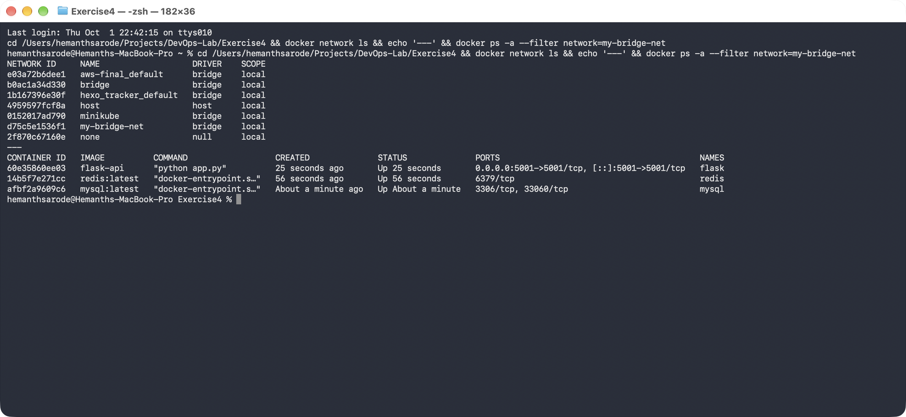
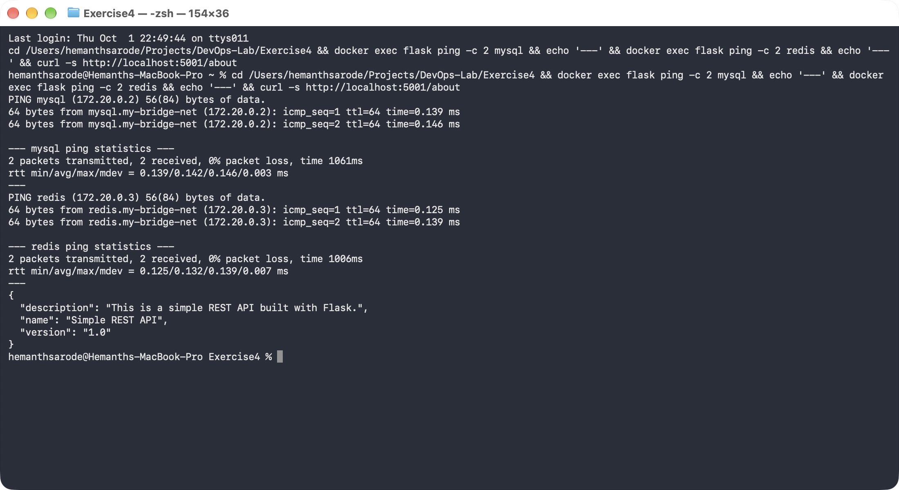

# Exercise 4: Docker Networking with Multiple Containers

## Objective

Understand Docker networking concepts by configuring a multi-container
application: a Flask web server, a MySQL database, and a Redis cache, all
communicating over a user-defined bridge network.

## Environment

- Operating System: macOS
- Architecture: Apple Silicon (arm64)
- Shell: Terminal / zsh
- Container Runtime: Docker Desktop

## Task 1: Create a Bridge Network

```bash
docker network create --driver bridge my-bridge-net
```

## Task 2: Verify the Network

```bash
docker network ls
```

`my-bridge-net` appeared alongside Docker's default networks, using the
`bridge` driver with `local` scope.

## Task 3: Inspect the Network

```bash
docker network inspect my-bridge-net
```

Docker assigned the network its own subnet (`172.20.0.0/16`) and gateway
(`172.20.0.1`).

## Task 4: Build and Launch the Containers

Flask app: [app.py](./app.py) exposes a single `/about` route returning
JSON. Dependencies: [requirements.txt](./requirements.txt). Container image:
[Dockerfile](./Dockerfile).

> **Note:** `requirements.txt` pins `Flask==2.0.1` as per the exercise. That
> version is incompatible with the Werkzeug release pip installs by default
> (`werkzeug.urls.url_quote` was removed), which crashed the container on
> start. Pinning `Werkzeug==2.0.3` alongside Flask fixed it.

Build the Flask image:

```bash
docker build -t flask-api .
```

Launch all three containers on the bridge network:

```bash
docker run -d --name mysql --net=my-bridge-net -e MYSQL_ROOT_PASSWORD=rootpass mysql:latest
docker run -d --name redis --net=my-bridge-net redis:latest
docker run -d --name flask --net=my-bridge-net -p 5001:5001 flask-api
```

> **Note:** `mysql:latest` requires `MYSQL_ROOT_PASSWORD` (or an equivalent)
> to be set, otherwise the container exits immediately — this wasn't in the
> original command but is required for the image to actually start.

All three containers reached `Up` status on `my-bridge-net`:



Confirmed the API was reachable from the host:

```bash
curl http://localhost:5001/about
```

## Task 5: Test Connectivity

Exec'd into the Flask container and pinged the other two containers by
name, confirming Docker's embedded DNS resolves container names to their
bridge-network IPs:

```bash
docker exec flask ping -c 2 mysql
docker exec flask ping -c 2 redis
```

Both resolved and responded (`mysql` at `172.20.0.2`, `redis` at
`172.20.0.3`), and the `/about` endpoint returned the expected JSON:



## Task 6: Clean Up

```bash
docker stop mysql redis flask
docker rm mysql redis flask
docker network rm my-bridge-net
```

---

## Key Concepts

- **`--net` flag** — connects a container to a specific Docker network instead of the default bridge.
- **Container-to-container communication** — containers on the same user-defined bridge network can reach each other by container name, thanks to Docker's embedded DNS.
- **Bridge vs. host network** — a bridge network isolates containers on a private virtual network (reached from the host only via published ports); a host network shares the host's network namespace directly, with no isolation or port mapping needed.
- **Exposing a port to the host** — the `-p <host-port>:<container-port>` flag on `docker run` publishes a container's port to the host machine.

## Result

Successfully created a custom bridge network, deployed Flask, MySQL, and
Redis containers onto it, and verified that the containers can resolve and
reach each other by name — while the Flask API remained accessible from the
host via its published port.
