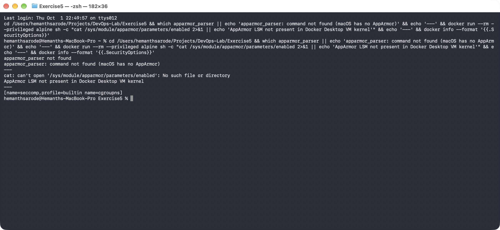
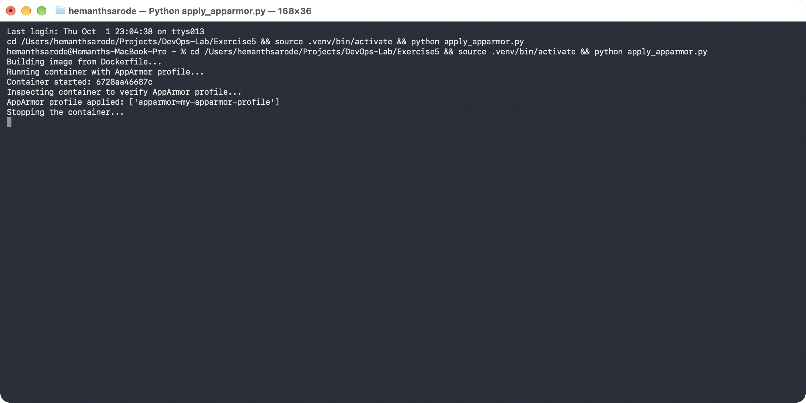
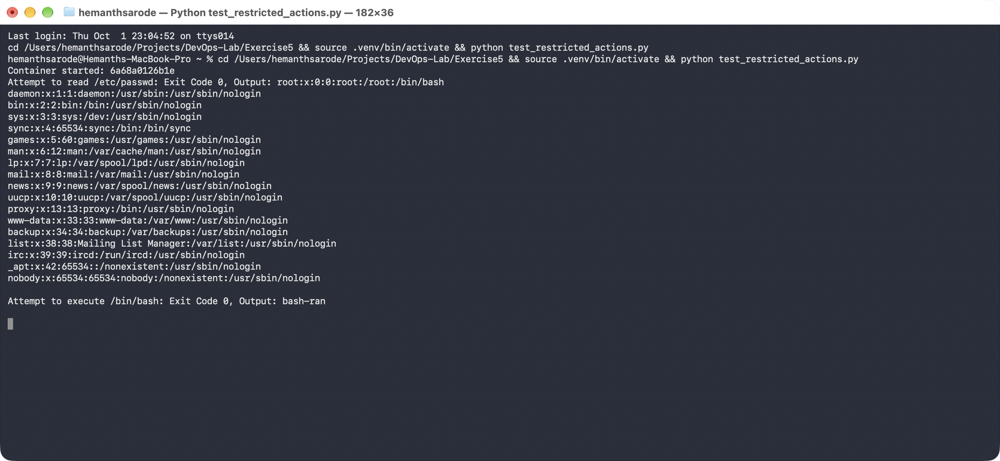

# Exercise 5: Docker Security with AppArmor and Python

## Objective

Secure a Dockerized Flask application with an AppArmor profile, apply and
verify that profile using the Docker SDK for Python, and test whether
restricted actions (reading `/etc/passwd`, executing `/bin/bash`) are
actually blocked inside the container.

## Environment

- Operating System: macOS
- Architecture: Apple Silicon (arm64)
- Shell: Terminal / zsh
- Container Runtime: Docker Desktop (LinuxKit VM)
- Python: 3.14 (host, via a local `.venv`) for the Docker SDK scripts

## Important Platform Limitation: AppArmor Is Not Available Here

AppArmor is a **Linux kernel** security module (LSM). This exercise assumes
an Ubuntu/Debian host with `apparmor-utils` installed and the AppArmor LSM
active in the kernel. Neither is true for this setup:

- **The host is macOS** — `apparmor_parser` doesn't exist here; it's only
  packaged for Linux distributions (`apt-get install apparmor-utils`).
- **Docker Desktop's container runtime is a lightweight LinuxKit VM**, and
  that VM's kernel does not compile in the AppArmor LSM at all. Checking
  `docker info` shows only `seccomp` and `cgroupns` under Security Options —
  no `apparmor`. Checking `/sys/module/apparmor/parameters/enabled` inside a
  privileged container confirms the module isn't present.

This was verified directly rather than assumed:



**Practical effect:** `docker run --security-opt="apparmor=<profile>"` does
not fail on this setup — Docker happily records the option and the
container starts normally — but the profile is never actually loaded or
enforced by the kernel, because there is no AppArmor LSM to enforce it.
Everything below was still carried out so the mechanics (building the
image, writing the profile, applying it via the Docker SDK, and testing
restricted actions) are demonstrated end-to-end, with the real, honest
result of that enforcement gap documented in Task 5.

## Task 1: Flask Application

File: [app.py](./app.py) — a single `/` route returning a plain-text
greeting.

## Task 2: Containerize the Application

File: [Dockerfile](./Dockerfile), built as:

```bash
docker build -t flask-apparmor .
```

> **Note:** macOS reserves port `5000` for AirPlay Receiver (ControlCenter),
> so containers in this exercise are published on host port **5050**
> instead (`-p 5050:5000`), while the Flask app itself still listens on
> `5000` inside the container as the exercise specifies.

## Task 3: Create and "Apply" the AppArmor Profile

File: [my-apparmor-profile](./my-apparmor-profile) — denies read access to
`/etc/**`, read/write to `/var/**`, execution of binaries under `/bin/**`
and `/usr/bin/**`, and the `sys_admin` capability, while allowing the app's
own `/app/**` directory and binding to a network port.

Loading the profile with `apparmor_parser` (Task 3b) is not possible on
macOS — there is no such tool. Running the container with the profile
attached still works, since Docker doesn't validate that the named profile
exists on platforms without AppArmor:

```bash
docker run --security-opt="apparmor=my-apparmor-profile" -p 5050:5000 flask-apparmor
```

The container started normally, served requests on `/`, and
`docker inspect` reported the profile name under `HostConfig.SecurityOpt` —
but, per the limitation above, this is bookkeeping only, not enforcement.

## Task 4: Apply the Profile via the Docker SDK

Script: [apply_apparmor.py](./apply_apparmor.py). Set up a local virtual
environment and installed the SDK:

```bash
python3 -m venv .venv
.venv/bin/pip install docker
.venv/bin/python apply_apparmor.py
```

Output:

```
Building image from Dockerfile...
Running container with AppArmor profile...
Container started: 6728aa46687c
Inspecting container to verify AppArmor profile...
AppArmor profile applied: ['apparmor=my-apparmor-profile']
Stopping the container...
```



This matches the exercise's expected output shape — Docker reports the
profile as "applied" — but as established above, that string only reflects
what was requested, not what the kernel is enforcing.

## Task 5: Test Restricted Actions

Script: [test_restricted_actions.py](./test_restricted_actions.py), run the
same way:

```bash
.venv/bin/python test_restricted_actions.py
```

**Actual output on this platform:**

```
Container started: 6a68a0126b1e
Attempt to read /etc/passwd: Exit Code 0, Output: root:x:0:0:root:/root:/bin/bash
... (full passwd file printed) ...
Attempt to execute /bin/bash: Exit Code 0, Output: bash-ran
```



This is the opposite of the exercise's expected result (`Exit Code 1` for
the `/etc/passwd` read, `Exit Code 126` for the `bash` exec). Both actions
succeeded with `Exit Code 0`, because — as confirmed in the platform-check
step — there is no AppArmor LSM in Docker Desktop's kernel to enforce the
`deny` rules in `my-apparmor-profile`. The profile is attached to the
container's metadata but never loaded.

## Task 6: Clean Up

```bash
docker ps -a --filter "ancestor=flask-apparmor" --format '{{.ID}}' | xargs docker rm -f
```

---

## Key Concepts

- **Purpose of AppArmor with Docker** — confines a containerized process to an explicit allow/deny policy (file paths, capabilities, network), adding defense-in-depth beyond the default container boundary.
- **How AppArmor profiles secure a container** — they are enforced by the Linux kernel itself, independent of the application, so even a compromised process inside the container can't exceed the profile's rules.
- **Why restrict `/etc/` and `/var/`** — those paths hold credentials, configuration, and system state; unrestricted read/write access there turns a container compromise into a host/application compromise.
- **Other restrictable capabilities** — binary execution, network binding, mount/remount, raw sockets, and Linux capabilities like `cap_sys_admin`, `cap_net_raw`, etc.
- **Verifying a profile is applied** — `docker inspect <container>` (or the Docker SDK's `inspect_container`) and look at `HostConfig.SecurityOpt`. This exercise is a useful reminder that this only confirms the profile was *requested* — confirming it's actually *enforced* requires checking that the AppArmor LSM is active on the host kernel in the first place (e.g. `aa-status`, or `/sys/module/apparmor/parameters/enabled`).

## Result

Built and ran the Flask container, wrote an AppArmor profile, and applied it
through both the Docker CLI and the Docker SDK for Python exactly as the
exercise describes. Testing restricted actions surfaced a genuine platform
limitation: Docker Desktop for Mac's LinuxKit VM has no AppArmor LSM, so the
`--security-opt apparmor=...` flag is accepted but not enforced — reading
`/etc/passwd` and executing `/bin/bash` both succeeded instead of being
blocked. Reproducing actual enforcement would require running Docker on a
Linux host with `apparmor-utils` installed and the AppArmor LSM enabled in
the kernel.
